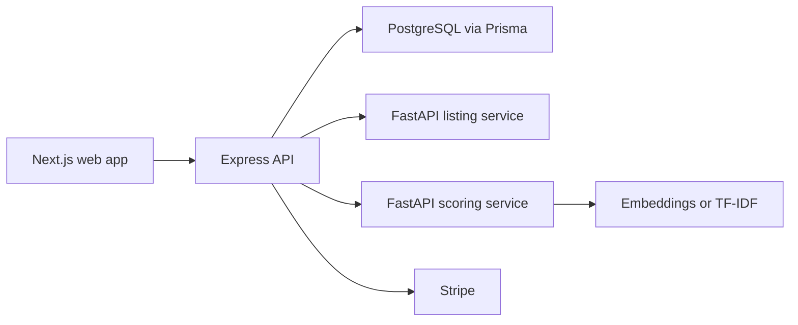

# GetHiredASAP

A full-stack portfolio project that collects recent job listings, compares them with a candidate profile, and ranks likely matches so applications can be prioritized quickly.

[Product site](https://gethiredasap.ca) · [GitHub profile](https://github.com/aryan880)

> **Project status:** active portfolio build. The repository demonstrates the product architecture and implemented flows; it does not claim production-scale usage or matching accuracy benchmarks.

## What is implemented

- Account registration and login with bcrypt password hashing and JWT access/refresh tokens
- Search preferences and candidate resume text stored through Prisma
- A Python/FastAPI ingestion service for collecting recent public job listings
- Batch job-to-resume scoring using sentence-transformer embeddings, with a TF-IDF fallback
- Early-career signal detection and experience-requirement extraction
- PostgreSQL persistence for jobs, matches, searches, users, and in-app alert records
- Ranked and paginated match APIs with score and early-career filters
- Stripe Checkout and webhook flows for subscription tiers
- A Next.js dashboard and pricing experience
- Local PostgreSQL and Redis services through Docker Compose

External messaging notifications and mobile clients are roadmap work; the current worker records qualifying alerts in the application database.

## Architecture



## Technology

| Area | Tools |
|---|---|
| Web | Next.js 16, React 19, TypeScript, TanStack Query, Tailwind CSS |
| API | Node.js, Express, Zod, JWT, bcrypt |
| Data | PostgreSQL, Prisma, Redis |
| Python services | FastAPI, sentence-transformers, scikit-learn, Beautiful Soup |
| Payments | Stripe Checkout and webhooks |
| Tooling | npm workspaces, Turborepo, Docker Compose |

## Repository layout

```text
apps/
  api/            Express API, Prisma schema, authentication, matching pipeline
  web/            Next.js application
packages/
  nlp/            FastAPI scoring service
  scraper/        FastAPI listing-ingestion service
docker-compose.yml
```

## Matching pipeline

1. Load an active user's searches and candidate text.
2. Collect listings for each role/location query.
3. Remove listings already matched for that user.
4. Score new listings in a batch.
5. adjust the score using detected experience requirements and early-career signals.
6. Store jobs and user-specific matches, then create an in-app alert record when a threshold is met.

The scoring service uses `all-MiniLM-L6-v2` when sentence-transformers is installed. If it is unavailable, the service falls back to TF-IDF cosine similarity.

## Run locally

### Requirements

- Node.js 18+
- npm 10+
- Python 3.12+
- Docker Desktop

### 1. Install and start data services

```bash
git clone https://github.com/aryan880/gethiredasap.git
cd gethiredasap
npm install
docker compose up -d
```

The Docker password is for local development only. Use separate secrets for any deployed environment.

### 2. Configure the API

```bash
cp apps/api/.env.example apps/api/.env
cd apps/api
npx prisma migrate dev
cd ../..
```

Replace every placeholder secret before running the API.

### 3. Install Python dependencies

```bash
python3 -m venv packages/nlp/.venv
source packages/nlp/.venv/bin/activate
pip install -r packages/nlp/requirements.txt
deactivate

python3 -m venv packages/scraper/.venv
source packages/scraper/.venv/bin/activate
pip install -r packages/scraper/requirements.txt
deactivate
```

### 4. Start the services

Run each command in its own terminal:

```bash
npm --workspace apps/web run dev
npm --workspace apps/api run dev
source packages/nlp/.venv/bin/activate && uvicorn packages.nlp.main:app --port 8002
source packages/scraper/.venv/bin/activate && uvicorn packages.scraper.main:app --port 8001
```

Open [http://localhost:3000](http://localhost:3000).

## Responsible use

Listing sources can change and may impose their own terms and rate limits. This project is intended to demonstrate full-stack architecture, data processing, and matching logic; anyone running the ingestion service is responsible for complying with applicable source terms and privacy requirements.

## What this project demonstrates

- Designing a multi-service TypeScript/Python system
- Connecting a product UI to authenticated APIs and relational data
- Building an explainable scoring pipeline with a graceful fallback
- Separating ingestion, matching, persistence, and presentation concerns
- Integrating third-party billing without committing credentials

Built by [Aryan Sawhney](https://github.com/aryan880).
