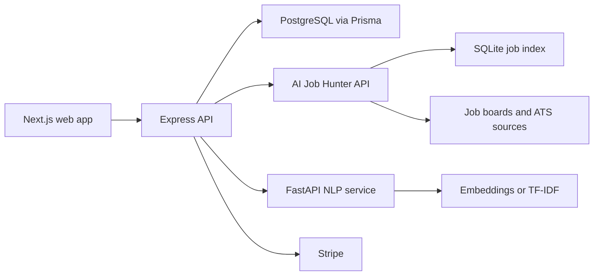

# GetHiredASAP

A full-stack job discovery and application platform that combines a broad job-ingestion engine with personalized resume matching, saved searches, and an application CRM.

[Product site](https://gethiredasap.ca) · [GitHub profile](https://github.com/aryan880)

> **Project status:** active portfolio build. The repository demonstrates the product architecture and implemented flows; it does not claim production-scale usage or matching accuracy benchmarks.

## What is implemented

- Account registration and login with bcrypt password hashing and JWT access/refresh tokens
- Protected dashboards, job feeds, saved searches, and application workflow APIs
- AI Job Hunter integration for normalized, deduplicated listings from job boards, ATS providers, public-sector portals, and employer career pages
- Batch job-to-resume scoring using sentence-transformer embeddings, with a TF-IDF fallback
- Explainable personalized matches and rule-based resume-gap analysis
- Saved searches with strict, role-family, and broad matching modes
- Application tracking for saved, applied, interview, offer, and rejected states
- PostgreSQL persistence for users, resumes, saved searches, alerts, and application workflow state
- Server-side job pagination, filtering, sorting, dashboard analytics, and source health views
- Stripe Checkout and webhook flows for subscription tiers
- Local PostgreSQL and Redis services through Docker Compose

## Architecture



AI Job Hunter is the discovery engine and remains the source of truth for job listings. GetHiredASAP stores user accounts, resumes, saved searches, alerts, and application workflow state. The legacy scraper package remains available but is disabled by default.

## Technology

| Area | Tools |
|---|---|
| Web | Next.js 16, React 19, TypeScript, TanStack Query |
| API | Node.js, Express, Zod, JWT, bcrypt |
| Data | PostgreSQL, Prisma, Redis |
| Matching | FastAPI, sentence-transformers, scikit-learn |
| Job ingestion | AI Job Hunter, Python, SQLite, JobSpy, ATS adapters |
| Payments | Stripe Checkout and webhooks |
| Tooling | npm workspaces, Turborepo, Docker Compose |

## Repository layout

```text
apps/
  api/            Express API, Prisma schema, auth, workflow, job proxy
  web/            Next.js dashboard and job-search experience
packages/
  nlp/            FastAPI semantic scoring service
  scraper/        Legacy listing service, disabled by default
docker-compose.yml
```

AI Job Hunter currently runs as a separate Python service and exposes its SQLite job index through an internal-key-protected FastAPI API.

## Job and matching flow

1. AI Job Hunter collects, validates, normalizes, and deduplicates listings.
2. GetHiredASAP requests paginated jobs through the internal API boundary.
3. The Express API loads the authenticated user resume and preferences from PostgreSQL.
4. Up to 100 candidate jobs are scored in one NLP batch request.
5. Semantic, rule, freshness, location, and source signals are combined into explainable matches.
6. If NLP is unavailable, matching falls back to the rule-based scorer.
7. Application status and recruiter notes remain user-specific in PostgreSQL.

The scoring service uses `all-MiniLM-L6-v2` when sentence-transformers is installed. If it is unavailable, the service falls back to TF-IDF cosine similarity.

## Run locally

### Requirements

- Node.js 18+
- npm 10+
- Python 3.10+
- Docker Desktop
- A local AI Job Hunter checkout

### 1. Install and start data services

```bash
git clone https://github.com/aryan880/gethiredasap.git
cd gethiredasap
npm install
docker compose up -d
```

### 2. Configure the API

```bash
cp apps/api/.env.example apps/api/.env
cd apps/api
npx prisma migrate dev
cd ../..
```

Replace every placeholder secret before running the API. `JOB_HUNTER_API_KEY` must match AI Job Hunter's `AI_JOB_HUNTER_API_KEY`, and `NLP_API_KEY` must match the NLP service configuration.

### 3. Install NLP dependencies

```bash
python3 -m venv packages/nlp/.venv
source packages/nlp/.venv/bin/activate
pip install -r packages/nlp/requirements.txt
deactivate
```

### 4. Start the services

Run each command in its own terminal.

AI Job Hunter:

```bash
cd "../AI Job Hunter"
source .venv/bin/activate
uvicorn api_app:app --host 127.0.0.1 --port 8010 --reload
```

NLP service:

```bash
cd gethiredasap
source packages/nlp/.venv/bin/activate
uvicorn packages.nlp.main:app --host 127.0.0.1 --port 8002 --reload
```

Express API and Next.js web app:

```bash
npm --workspace api run dev
npm --workspace web run dev
```

Open [http://localhost:3000](http://localhost:3000).

## Common commands

```bash
npm --workspace api run build
npm --workspace web run build
docker compose ps
curl http://localhost:3001/health
```

The authenticated job routes are mounted under `/api/job-hunter`, including jobs, summary, personalized matches, resume-gap analysis, command-center analytics, and manual refresh.

## Legacy scraper

The old scraper code remains under `packages/scraper`, but the API does not start its scheduler or perform an initial scrape unless explicitly enabled:

```text
ENABLE_LEGACY_SCRAPER=false
```

Expected API startup output:

```text
Legacy scraper disabled. Using AI Job Hunter API as job source.
```

## Responsible use

Job sources can change and may impose their own terms and rate limits. Anyone operating the ingestion service is responsible for source terms, privacy requirements, secure secret management, and appropriate request frequency.

## What this project demonstrates

- Designing a multi-service TypeScript and Python system
- Connecting a product UI to authenticated APIs and relational data
- Separating global job discovery from per-user personalization and workflow state
- Building explainable semantic matching with a graceful fallback
- Managing server-side pagination, saved searches, and application tracking
- Integrating third-party billing without committing credentials

Built by [Aryan Sawhney](https://github.com/aryan880).
