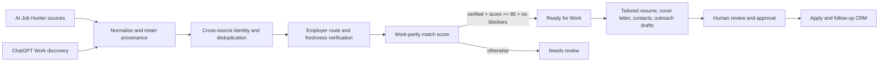

# Application Pipeline

GetHiredASAP is the canonical system of record for a job seeker. AI Job Hunter
is the discovery engine. ChatGPT Work is an optional research and document
generation client. Neither discovery nor generation can silently bypass the
verification and approval gates in GetHiredASAP.

## Product flow

## Responsibilities

### AI Job Hunter

- Poll structured ATS, employer, public-sector, startup, and aggregator sources.
- Preserve source-native posting IDs, requisition IDs, listing URLs, direct
  application URLs, and URL provenance.
- Record raw, rejected, same-source duplicate, cross-source duplicate,
  inserted, and refreshed counts separately.
- Publish source health, last success, runtime, next run, and failure state.
- Return normalized job observations to GetHiredASAP.

### GetHiredASAP

- Own the canonical job identity and retain every source observation.
- Store the verification evidence and a versioned scoring snapshot.
- Enforce the generation gate and workflow state transitions.
- Encrypt candidate documents at rest and organize them by resume family.
- Store tailored documents, verified contacts, outreach drafts, application
  status, and follow-up history for the authenticated user.
- Never automatically send outreach or submit an application.

### ChatGPT Work

- Perform deeper legitimacy, date, and direct-route verification for queued
  jobs.
- Generate tailored documents from a verified job description and the correct
  master resume family.
- Research relevant public contacts and retain evidence URLs.
- Draft email and LinkedIn outreach for user review.
- Write results back through authenticated, user-scoped tools. Work is not an
  embeddable product backend and is not required for core GetHiredASAP use.

## Current generation gate

A package moves to `READY_FOR_WORK` only when all conditions are true:

1. Verification status is `VERIFIED_OPEN`.
2. A valid direct application URL is recorded.
3. URL provenance is `EMPLOYER_ATS` or `EMPLOYER_CAREERS`.
4. The versioned fit score is at least 80.
5. There are no hard blockers.

Freshness is retained as a separate score. An excellent older role can still be
prepared, but it remains lower priority than a newly published role.

## Job identity and URL evidence

`ApplicationPackage` is the canonical user-facing job. Each discovery is stored
as a `JobSourceObservation`, so LinkedIn, Job Bank, and an employer ATS copy can
point to the same package without losing their individual timestamps or URLs.

Canonical identity prefers, in order:

1. Employer plus requisition ID.
2. Canonical employer application URL.
3. Company, title, location, and credible publication day.
4. A conservative source-specific fallback when evidence is weak.

URL provenance is one of `EMPLOYER_ATS`, `EMPLOYER_CAREERS`,
`AGGREGATOR_DETAIL`, `REDIRECT`, or `UNKNOWN`. An aggregator detail URL is useful
evidence but does not pass the generation gate by itself.

## Source work based on the July 22 audit

The audit found six reusable adapters among the nine primary ATS targets and no
automatic polling. The source-layer implementation order is:

1. Add scheduler ownership and per-source locks.
2. Repair Workday tenant/site discovery and the UBC/Salesforce response bug.
3. Validate stale Greenhouse and Lever tokens before every registration.
4. Implement reusable SmartRecruiters and Jobvite adapters.
5. Generalize Oracle/Taleo and replace the fake PeopleSoft wrapper.
6. Activate priority banks, insurers, private employers, and identifiable
   public-sector ATS sources through reusable adapters.
7. Expand from 13 healthy direct private employers toward an explicit 50-75
   employer registry.

Blocked portals stay disabled unless an official API, feed, or permitted stable
path exists. Search-engine snippets and anti-bot workarounds are not a reliable
production ingestion strategy.

## Recommended polling

The objective is low discovery latency without hammering every source every two
minutes.

| Source class | Suggested interval | Notes |
|---|---:|---|
| High-priority direct ATS/employers | 3-5 minutes | Add jitter, conditional requests, and a per-source lock. |
| Public-sector and universities | 10-15 minutes | Usually lower posting frequency; direct feeds remain authoritative. |
| Structured aggregators and startup boards | 10-20 minutes | Use for recall and always retain provenance. |
| Broken/blocked diagnostics | 6-24 hours | Health check only; do not waste the first-wave polling budget. |

Each run records planned interval, start time, finish time, runtime, next run,
raw count, rejects, duplicate classes, inserts, refreshes, and a compact error.

## ChatGPT Work tool contract

The future authenticated remote tool surface should be narrow and idempotent:

- `list_packages_ready_for_work`
- `get_application_package`
- `get_master_resume`
- `set_package_status`
- `upload_package_document`
- `add_verified_contact`
- `add_outreach_draft`
- `complete_application_package`

Every tool scopes data to the authenticated user and accepts an idempotency key.
Contact email addresses require a public evidence URL; guessed company email
patterns are rejected. Generated outreach is always created as `DRAFT`.

## Document storage

The MVP stores small PDF, DOCX, Markdown, and text files as AES-256-GCM encrypted
bytes. The encryption key is supplied through `DOCUMENT_ENCRYPTION_KEY` and is
never stored in the database. The data model also includes optional Library IDs
and paths. A later object-storage implementation can replace ciphertext bytes
with private object keys while preserving the document and package APIs.

Master resume families are `SOFTWARE`, `IT_SUPPORT`, `SYSTEMS_ANALYST`,
`GENERAL`, and `CUSTOM`. Only one document per family is active as the master at
a time.

## Remaining production work

- Apply the Prisma migration in a staging database and run authenticated route
  integration tests.
- Add private object storage, malware scanning, retention controls, and key
  rotation before storing production user documents at scale.
- Add the source-aware scheduler and missing adapters in the separate AI Job
  Hunter repository.
- Add remote MCP authentication and per-user authorization for ChatGPT Work.
- Add package generation workers, retries, idempotency, audit history, and
  notifications.
- Add explicit consent and provider-specific controls before any future email
  or LinkedIn sending integration.
